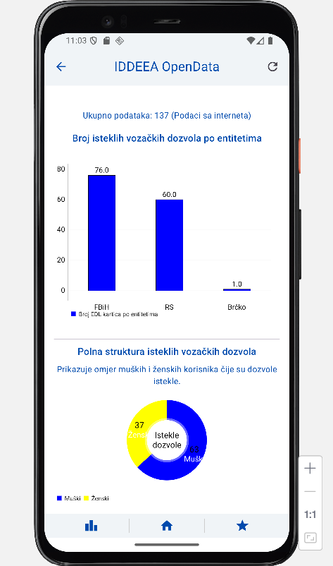

# Dokumentacija za IDDEEA Open Data Android aplikaciju

## 1. Opis rada aplikacije

IDDEEA Open Data je Android aplikacija razvijena s ciljem da korisnicima pruži jednostavan i brz pristup otvorenim skupovima podataka koje objavljuje Agencija za identifikacione dokumente, evidenciju i razmjenu podataka Bosne i Hercegovine (IDDEEA). Fokus aplikacije je na prikazu podataka o izdatim ličnim kartama, isteklih vozačkih dozvola te drugim relevantnim informacijama vezanim za lične dokumente građana BiH.

Aplikacija korisnicima omogućava pregled podataka u realnom vremenu putem REST API servisa, kao i rad u offline režimu zahvaljujući lokalnom keširanju podataka. Implementirane su napredne funkcionalnosti poput filtriranja podataka po entitetima, kantonima i opštinama, grafičkog prikaza statistike te spremanja omiljenih zapisa u lokalnu bazu podataka.

Korisnički interfejs aplikacije izrađen je koristeći moderni Jetpack Compose framework. Posebna pažnja posvećena je jednostavnosti upotrebe i jasnoći prikaza informacija.

### 1.1. Slike ekrana (Screenshots)

### Splash Screen


### OnBoarding Screen


### Home Screen 


### Ekran sa izdanim ličnim kartama


### Ekran sa nevažećim vozačkim dozvolama 


### Favourites Screen 


### Statistics Screen 


## 2. Arhitektura aplikacije

Aplikacija koristi arhitektonski obrazac **MVVM (Model-View-ViewModel)** koji omogućava jasnu separaciju odgovornosti, jednostavno testiranje i skalabilnost.

### 2.1. Dijagram komponenti i njihovih interakcija


- **View**: Prikazuje korisničko sučelje i osluškuje promjene stanja iz ViewModel-a.
- **ViewModel**: Posreduje između View-a i poslovne logike. Upravljanje podacima, filtrima i stanjima.
- **Repository**: Centralna tačka pristupa podacima. Upravljanje pozivima prema API-ju i lokalnoj bazi.
- **Lokalna baza (Room)**: Čuva omiljene zapise i omogućava offline pristup.
- **API servis (Retrofit)**: Komunikacija s REST servisom IDDEEA OpenData.

## 3. Ključne komponente aplikacije

### 3.1. ViewModel sloj

- **IssuedIdCardsViewModel** – upravlja podacima o izdatim ličnim kartama
- **ExpiredDLCardsViewModel** – upravlja isteklih vozačkih dozvola
- **UniversalViewModel** – zajednički filteri i rad sa omiljenim zapisima

ViewModel-i koriste **StateFlow**, **MutableState**, `viewModelScope.launch`, Room i Retrofit. Prije svakog poziva podataka koriste `NetworkUtils` kako bi provjerili:

- Ako ima interneta: dohvaćaju podatke sa API-ja
- Ako nema interneta: koriste lokalno keširane podatke iz Room baze

### 3.2. NetworkUtils

Pomoćna klasa koja koristi `ConnectivityManager` i `NetworkCapabilities` za provjeru dostupnosti interneta.

```kotlin
 fun hasInternetConnection(context: Context): Boolean
 ```

ViewModel-i koriste ovu funkciju za donošenje odluka o izvoru podataka.

### 3.3. Repository sloj

- `IssuedIdCardsRepository`, `ExpiredDLCardsRepository`  
Biraju između mrežnih i lokalnih podataka, implementiraju keširanje i logiku sortiranja/filtriranja.

### 3.4. DAO i Room baza

- `FavouritesDao` – metode za rad sa omiljenim zapisima

Room omogućava:
- Offline pristup
- Upravljanje favoritima
- Brzo učitavanje keširanih podataka

### 3.5. Retrofit sloj

- `ApiService.kt` – definicija API endpoint-a
- `RetrofitInstance.kt` – Singleton Retrofit klijenta

### 3.6. Compose UI struktura

**Glavni ekrani:**
- `HomeScreen` – Početni ekran aplikacije
- `IssuedIdCardsScreen` – Lista ličnih karti + filter
- `ExpiredDLCardsScreen` – Lista vozačkih dozvola
- `FavouritesScreen` – Pregled sačuvanih zapisa
- `StatistikaScreen` – Grafički prikaz podataka

**Komponente:**
- `TopBar.kt` – Naslov i dugme za povratak
- `BottomBar.kt` – Navigacija po sekcijama

## Objašnjenje korištenih tehnologija

### Coroutines
Omogućavaju asinhrone zadatke bez blokiranja glavnog UI threada:
- API pozivi
- Rad sa bazom
- `viewModelScope.launch { ... }` za pokretanje korutina

### Flow
Reaktivan tok podataka:
- Posmatranje promjena Room baze
- Emitovanje stanja UI-a (Loading, Error, Success)

### Room
Jetpack biblioteka za lokalnu bazu podataka:
- `@Entity` – definicija tabela
- `@Dao` – SQL metode
- `@Database` – veza između DAO-a i baze

### Retrofit
Mrežni klijent za komunikaciju sa REST API-jem:
- `@POST`, `@GET` metode
- `GsonConverterFactory` za parsiranje JSON-a
- Korištenje suspend funkcija

### Navigation Compose
Deklarativna navigacija između ekrana:
- `NavHost`, `NavController`, `composable` rute

### Jetpack Compose
Moderno deklarativno korisničko sučelje:
- `@Composable` funkcije za definiranje UI-a
- `LazyColumn`, `Box`, `Spacer` elementi
- `AndroidView` za integraciju MPAndroidChart grafova

## Statistike i vizualizacije

Korištena biblioteka: **MPAndroidChart**

- **BarChart** – distribucija podataka po sedmicama
- **PieChart** – udio po entitetima

## Zaključak

IDDEEA Open Data aplikacija implementira moderne Android standarde:
- Jetpack Compose UI
- Room za offline podatke
- Retrofit za mrežni sloj
- Flow i Coroutines za reaktivan kod
- MVVM arhitektura
- Navigation Compose i Material 3 dizajn

Aplikacija je modularna, stabilna i spremna za skaliranje i dalji razvoj.
